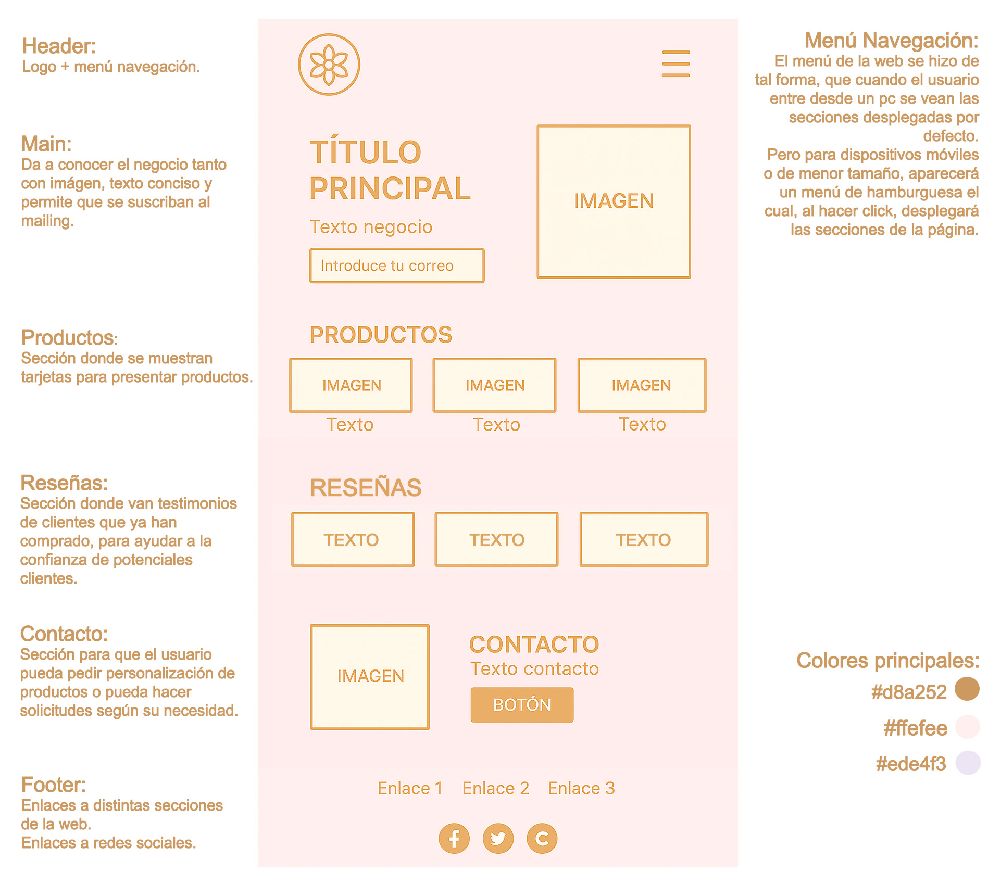

# Proyecto3
Landing Page Negocio - Proyecto 3 | Bootcamp Desarrollo Web

Este sitio fue creado como parte del tercer proyecto, correspondiente al módulo de HTML y CSS. Tomé como inspiración mi tienda real de joyas, aunque modifiqué el logo, levemente algunos elementos visuales y colores para permitirme experimentar más y jugar con el css.

---

## 🌟 Descripción del Proyecto

Se pidió realizar una web de aterrizaje para un negocio, con el objetivo de poder aplicar los conocimientos aprendidos del módulo. Para esto se incluyó:

- 🌺 **Header:** con logo y menú de navegación.
- 💫 **Main:** presentación del negocio con imagen, frase inspiradora e invitación a suscribirse al newsletter.
- 🛍️ **Productos:** sección con tarjetas para mostrar distintos tipos de joyas (collares, aros, pulseras, tobilleras).
- 💌 **Reseñas:** testimonios de clientas felices que son muy efectivos para crear confianza y convertir.
- 📬 **Contacto:** llamado a personalizar joyas o realizar requerimientos especiales con un botón destacado.
- 🌐 **Footer:** enlaces útiles y redes sociales.

---

## 📸 Prototipo Final

Se realizó un prototipo de cómo se pensó realizar el proyecto desde un inicio, tener en cuenta los elementos que debía poseer y su distribución. 

---

## 🖥️ Tecnologías Usadas

- HTML5
- CSS
- Responsive Web Design (con Media Queries)
- Íconos de Font Awesome
- Diseño basado en prototipo propio (ver imagen arriba)

---

## 📱 Responsive Design

La web está diseñada para adaptarse tanto a pantallas grandes como a dispositivos móviles. Se implementó un menú hamburguesa que se despliega solo en resoluciones pequeñas, y se reorganizan las secciones como  `main` y `contacto` para que la experiencia sea óptima en celulares. 
En la versión para escritorio:
- La sección `main` presenta primero el texto (título, descripción y formulario) a la izquierda y la imagen a la derecha.

En la versión móvil:
- La imagen se muestra antes del texto, priorizando un impacto visual atractivo en pantallas pequeñas.

---

## 🛠️ Funcionalidades implementadas

- `grid` para organización visual fluida
- `hover effects` en productos
- `formulario de suscripción`
- `botón personalizado` para contacto
- `responsive menu` con JavaScript básico

---

## 🧠 Aprendizajes del Proyecto

- Creación de estructura semántica con HTML5.
- Aplicación de estilos visuales complejos. Evité usar frameworks para poder aprender desde la base.
- Organización modular de CSS.
- Implementación de diseño adaptable (Responsive).
- Práctica de control de versiones con Git y GitHub.
  
---

## 🧠 Conclusión

Este proyecto me permitió poner en práctica los conocimientos adquiridos en el desarrollo de sitios web estáticos utilizando HTML y CSS. A través de la creación de una landing page, reforcé la estructura semántica de HTML5 y profundicé en la aplicación de estilos mediante CSS, priorizando tanto la estética como la funcionalidad.
Implementar un diseño responsive fue uno de los principales desafíos, ya que implicó reorganizar los elementos visuales y asegurar una experiencia de usuario coherente en distintos tamaños de pantalla. También trabajé con grid, media queries, organización modular de archivos y lógica básica en JavaScript para el menú de navegación adaptable. Aunque no se creó un archivo .js externo, se incluyó un fragmento de JavaScript directamente en el HTML para lograr comportamiento interactivo responsive, como el despliegue del menú móvil mediante manipulación del DOM.
Además, aprendí a utilizar Git y GitHub para el control de versiones, lo cual facilitó la gestión del proyecto y permitió mantener un registro claro y ordenado de los cambios realizados. Esto incluye la creación de commits significativos, el uso de stash, rebase, y comandos como push --force en situaciones específicas, respetando siempre las buenas prácticas.
En resumen, este proyecto integró tanto la planificación visual a través de un prototipo como la implementación técnica del diseño, consolidando habilidades fundamentales para el desarrollo frontend.

---

## 🚀 Ver Sitio

Puedes ver el sitio funcionando aquí:  
➡️ [Ver landing en vivo](https://nicolemorenog.github.io/Proyecto3/)

---

Nicole Moreno. @NicoleMorenoG

